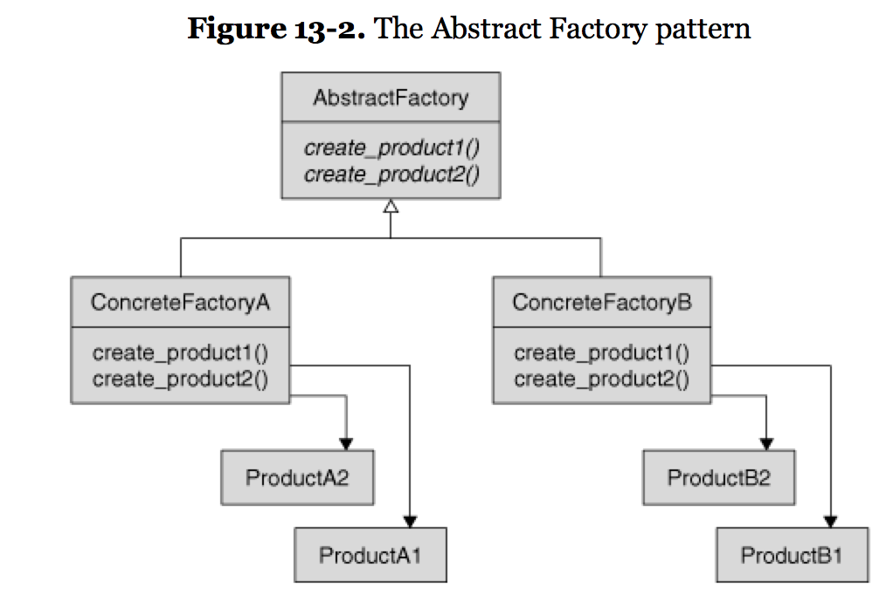
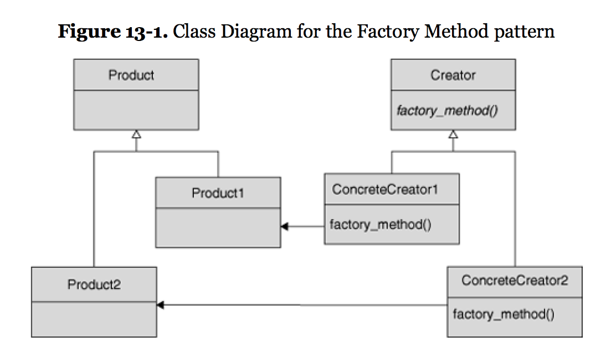
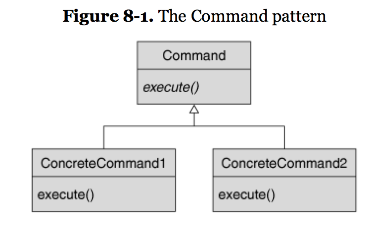
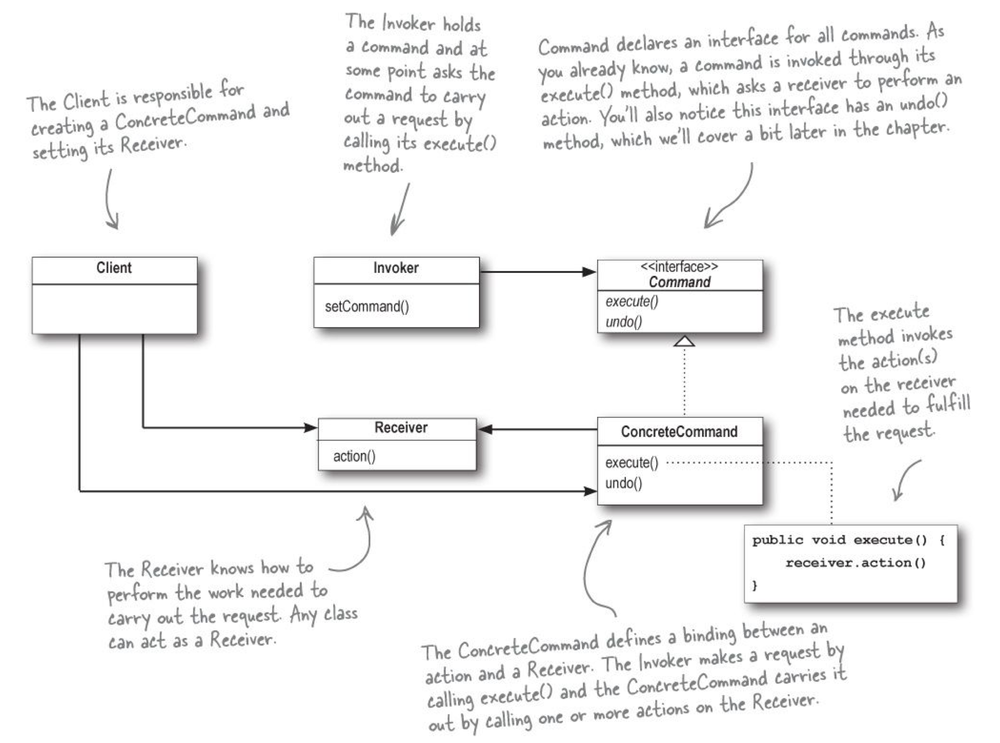
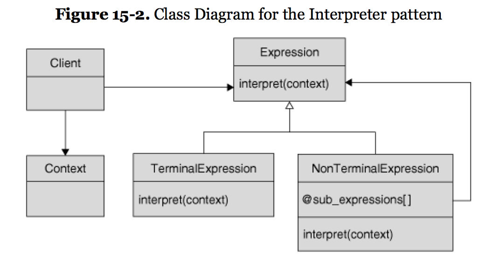
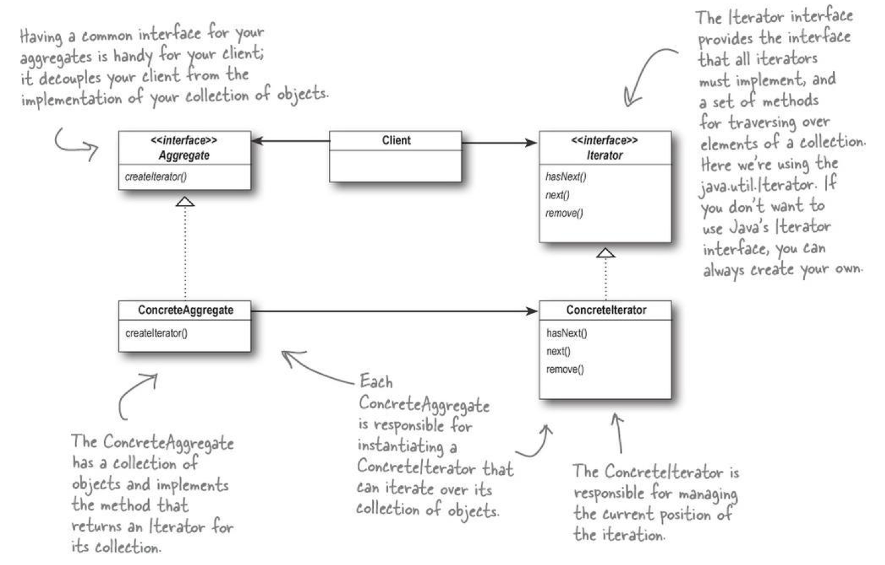
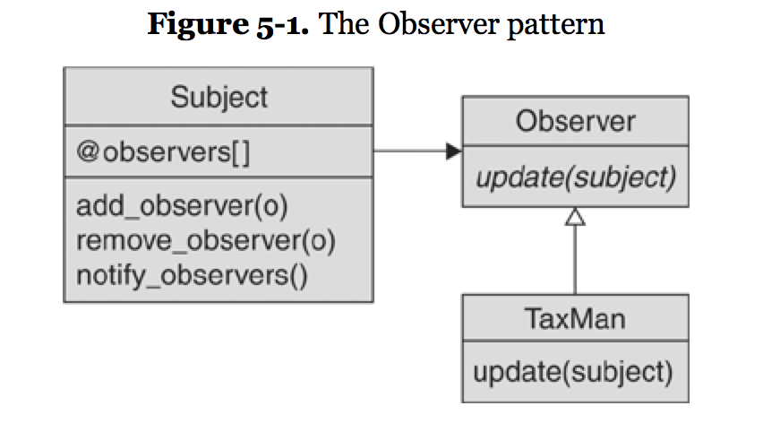
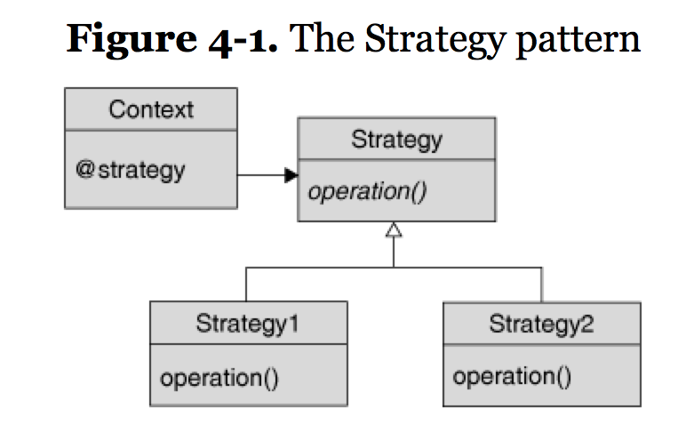
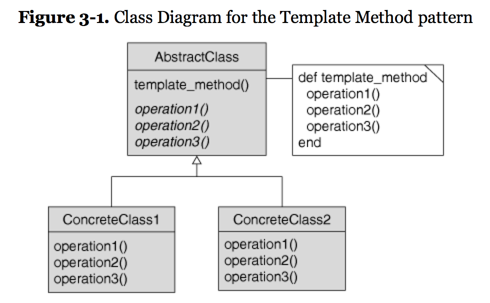

# Buck's Design Pattern Notes

## 23 original Design Patterns in GoF (Gang of Four, 1994):

Creational:
- Abstract Factory
- Builder
- Factory
- Prototype
- Singleton

Structural:
- Adapter
- Bridge
- Composite
- Decorator
- Facade
- Flyweight
- Proxy

Behavioral:
- Chain of Responsibility
- Command
- Interpreter
- Iterator
- Mediator
- Memento
- Observer
- State
- Strategy
- Template Method
- Visitor

## 14 Design Patterns in *Design Patterns in Ruby* (Olsen, 2008)
(Note: *Design Patterns in Ruby* (Olsen, 2008) covers the 14 "most widely used and useful" of the original 23 GoF patterns.  These 14 overlap almost exactly with the 14 patterns meriting their own chapters in the second-most-popular Design Pattern book (after GoF) *Head First: Design Patterns* (Freeman and Robson, 2009).  In *Head First: Design Patterns*, the remaining patterns, which they say "aren't used as often", are lumped together in an Appendix called "Leftovers".)

Creational:
- Abstract Factory
- Builder
- Factory
- Singleton

Structural:
- Adapter
- Composite
- Decorator
- Proxy

Behavioral:
- Command
- Interpreter
- Iterator
- Observer
- Strategy
- Template Method

## Definitions and Code:

Creational:

### Abstract Factory

An object dedicated to creating a compatible set of objects.  
The solution is to write a separate class to handle that creation.


```ruby
class PondOrganismFactory

  def new_animal(name)
    Frog.new(name)
  end

  def new_plant(name)
    Algae.new(name)
  end

end

class JungleOrganismFactory

  def new_animal(name)
    Tiger.new(name)
  end

  def new_plant(name)
    Tree.new(name)
  end

end

class Habitat

  def initialize(number_animals, number_plants, organism_factory)

    @organism_factory = organism_factory

    @animals = []
    number_animals.times do |i|
      animal = @organism_factory.new_animal("Animal#{i}")
      @animals << animal
    end

    @plants = []
    number_plants.times do |i|
      plant = @organism_factory.new_plant("Plant#{i}")
      @plants << plant
    end

  end

  # Rest of the class...
end

jungle = Habitat.new(1, 4, JungleOrganismFactory.new)
jungle.simulate_one_day
pond = Habitat.new( 2, 4, PondOrganismFactory.new)
pond.simulate_one_day

```


- Builder

### Factory
**Creators**: the base and concrete classes that contain the factory methods (e.g. PizzaStore, NYPizzaStore, ChicagoPizzaStore; Pond, DuckPond, FrogPond)
**Products**: the objects that are being created (Pizza, NYCheesePizza, ChicagoSausagePizza)

You can parameterize the creators' #initialize.
```ruby
class Pond
  def initialize(num_animals, animal_type, num_plants, plant_type)
    ...
  end
end
```



**Example Code**
```ruby
chicagoPizzaStore = ChicagoPizzaStore.new
chicagoPizzaStore.orderPizza("cheese")
# #orderPizza is in PizzaStore and #createPizza is in each of the
# subclassed PizzaStores.  #orderPizza calls #createPizza and there
# is a different #createPizza for each concrete PizzaStore class.
# This is an example of Duck Typing.  We can call #createPizza on
# any class that implements #createPizza.
```
- Singleton

Structural:
- Adapter
- Composite
- Decorator
- Proxy

Behavioral:

### Command
Encapsulates a request as an object.

Instead of creating a new Button class for every possible thing a Button could do, and having a separate #on_push method for every subclass (OpenDocumentButton#on_push, NewDocumentButton#on_push), create a subclass of Command and assign it dynamically to Button at runtime.

```ruby
class SlickButton

  attr_accessor :command

  def initialize(command)
    @command = command
  end

  #
  # Lots of button drawing and management
  # code omitted...
  #

  def on_button_push
    @command.execute if @command
  end
end

class SaveCommand
  def execute
    #
    # Save the current document...
    #
  end
end

# Associated the appropriate command with the Button when
# the Button is created.
save_button = SlickButton.new(SaveCommand.new)
```
The Command Pattern can also be used to group a bunch of commands together (using a Composite of Commands), Undo commands (for every execute method, implement an unexecute method), and Redo commands.





### Interpreter

- Build an Abstract Syntax Tree (AST)
- The AST consists of nodes either TerminalExpression (e.g. LiteralExpression) or NonTerminalExpression (e.g. Sequence-, Alternation-, or RepetitionExpression)
- Start at root of AST and recursively evaluate itself
  - Each node is a subclass of Expression with an #evaluate method that says how to evaluate (also called #interpret or #execute)
- The Context contains information that's global to the interpreter e.g. values of variables in an arithmetic expression.



### Iterator

An Iterator provides a way to access the elements of an aggregate object sequentially without exposing its underlying representation.  In other words, an Iterator provides the outside world with a sort of movable pointer into the objects stored inside an otherwise opaque aggregate object.



Iterators always include #has_next and #next.  Optionally they can include #item (current), #first (sets cursor back to first), and #remove (remove and return the current item).

```ruby
class ArrayIterator

  def initialize(array)
    @array = array
    @index = 0
  end

  def has_next?
    @index < @array.length
  end

  def item
    @array[@index]
  end

  def next_item
    value = @array[@index]
    @index += 1
    value
  end

end

```

### Observer

The Observer Pattern defines a one-to-many dependency between objects so that when one object changes state, all of its dependents are notified and updated automatically.

An Observer Pattern consists of a Subject (that is being observed e.g. an Employee or a Spreadsheet) and Observers (e.g. Payroll or TaxMan observe Employee, BarChart and GraphChart observe Spreadsheet).  The Observers register themselves with the Subject.

The Subject contains a list of Observers, and #add_observer, #remove_observer, and #notify_observers methods.

The Observer has an #update method which the Subject calls to notify.

Since anything under the sun might want to be observable, Subject (or Observable) should be a Ruby **module**.



```ruby
module Subject  # or 'Observable'

  def initialize
    @observers=[]
  end

  def add_observer(observer)
    @observers << observer
  end

  def delete_observer(observer)
    @observers.delete(observer)
  end

  def notify_observers
    @observers.each do |observer|
      observer.update(self)
    end
  end

end

class Employee
  include Subject

  attr_reader :name, :address
  attr_reader :salary

  def initialize( name, title, salary)
    super()
    @name = name
    @title = title
    @salary = salary
  end

  def salary=(new_salary)
    @salary = new_salary
    notify_observers
  end

end

fred = Employee.new('Fred', 'Crane Operator', 30000.0)
payroll = Payroll.new
fred.add_observer( payroll )
fred.salary=35000.0 # because #salary= calls notify_observers, Payroll will be notified

tax_man = TaxMan.new
fred.add_observer(tax_man)
fred.salary=90000.0 # now Payroll and the Tax Man will be notified.
```

Ruby actually comes with an Observable module:
```ruby
require 'observer'

class Foo
  include Observable

  ...
end
```

### Strategy

Context - the user of the Strategy (e.g. "Report")  
Strategy - family of objects that all do the same thing and support the same interface (e.g. superclass Formatter, subclasses HTMLFormatter and PlainTextFormatter, method #output_report)  


```ruby
class Report
  def initialize(formatter)
    ...
    @formatter = formatter
  end

  def output_report
    @formatter.output_report(self)  # passing self so formatter can have access to report data
  end
end

report = Report.new(HTMLFormatter.new)
report.output_report
report.formatter = PlainTextFormatter.new
report.output_report
```

### Template Method
The Template Method Pattern defines the skeleton of an algorithm in a method, deferring some steps to subclasses. Template Method lets subclasses redefine certain steps of an algorithm without changing the algorithm’s structure.



```ruby
class CaffeineBeverage
  def prepare_recipe
    boil_water
    brew
    pour_in_cup
    add_condiments
  end

  # Leave #brew and #add_condiments to subclasses as they
  # differ for Coffee and Tea.

  def boil_water
    # implementation. same for all subclasses
  end

  def pour_in_cup
    # implementation. same for all subclasses
  end
```
